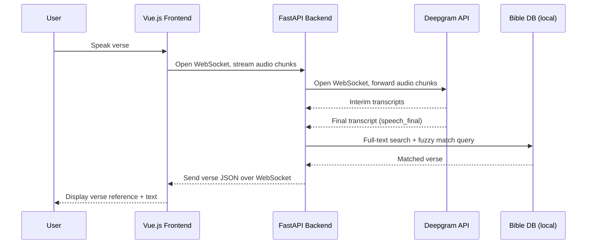

# Vers — Architecture & Data Flow (Diagram Source Document)

This document describes the Vers system in a structured way so it can be handed to an AI tool to generate a visual architecture diagram. It lists the components (nodes), the connections between them (edges, with protocol and direction), and the exact sequence of events for a single voice lookup.

## App Description

Vers is a voice-driven web app that identifies Bible verses from spoken audio. A user speaks a verse aloud; the app transcribes the speech, matches the transcript against a locally stored Bible database using classic text search (no AI/embeddings), and returns the matching book, chapter, verse, and full text.

## Components (Nodes)

1. **User / Microphone** — physical audio input source
2. **Vue.js Frontend (Browser)** — captures microphone audio, streams it out, displays the returned verse
3. **FastAPI Backend Server** — central orchestrator; relays audio to Deepgram, runs verse matching, relays results back
4. **Deepgram Streaming API (External Service)** — third-party speech-to-text engine, real-time streaming transcription
5. **Bible Verse Database (Local — SQLite/PostgreSQL)** — self-hosted, indexed with full-text search + trigram fuzzy matching; not a third-party API

## Connections (Edges)

| From | To | Protocol | Direction | Payload |
|---|---|---|---|---|
| User | Vue.js Frontend | Physical (microphone) | one-way | raw audio |
| Vue.js Frontend | FastAPI Backend | WebSocket (persistent) | bidirectional | binary audio chunks up / JSON status + verse data down |
| FastAPI Backend | Deepgram Streaming API | WebSocket (persistent) | bidirectional | binary audio chunks up / JSON transcript events down |
| FastAPI Backend | Bible Verse Database | Async SQL (local/same-host) | bidirectional | SQL query / matched verse row |

Note: Deepgram is the **only external network dependency**. The database connection is local and does not leave the backend's own infrastructure.

## Step-by-Step Data Flow (Sequence)

1. User taps "Listen" in the Vue.js frontend.
2. Frontend opens a WebSocket connection to the FastAPI backend (`wss://.../ws/listen`).
3. Backend opens its own separate WebSocket connection to Deepgram's streaming endpoint.
4. Frontend captures microphone audio via AudioWorklet and streams small raw-audio chunks (20–100ms) to the backend over the first WebSocket.
5. Backend immediately forwards each audio chunk to Deepgram over the second WebSocket (pass-through, no processing).
6. Deepgram streams back interim transcript events as speech is recognized, then a finalized transcript event once the user stops speaking (`speech_final: true`).
7. Backend receives the finalized transcript text.
8. Backend queries the local Bible database in two stages: (a) full-text search returns a shortlist of candidate verses, (b) trigram fuzzy matching ranks the shortlist and selects the best match.
9. Backend retrieves the matched verse's book, chapter, verse number, and text.
10. Backend sends the matched verse back to the frontend as JSON, over the original WebSocket connection (step 2).
11. Frontend displays the verse reference and text to the user.

## Key Architectural Notes (for diagram emphasis)

- Both WebSocket connections (frontend↔backend, backend↔Deepgram) are **persistent and bidirectional**, not simple one-shot request/response calls — draw them as continuous open channels, not arrows that fire once.
- There is an intentional **extra network hop** (Frontend → Backend → Deepgram, rather than Frontend → Deepgram directly). This is a deliberate tradeoff: it keeps the Deepgram API key server-side and lets verse matching happen immediately after transcription without another round trip.
- The Bible database is **local to the backend's infrastructure** — it should be drawn as internal to the backend's environment, not as an external API, to visually distinguish it from Deepgram.
- The matching step (full-text search → fuzzy ranking) is a **two-stage pipeline within the backend**, not a single black box — worth showing as two sub-steps if the diagram supports that level of detail.

## Suggested Diagram Type

A hybrid of:
- A **system architecture diagram** (labeled boxes for User, Frontend, Backend, Deepgram, Database; arrows labeled with protocol) for the overall shape, and
- A **numbered sequence diagram** using the 11 steps above for the actual data flow of a single voice lookup.

## Appendix: Mermaid Sketch (optional starting point)

