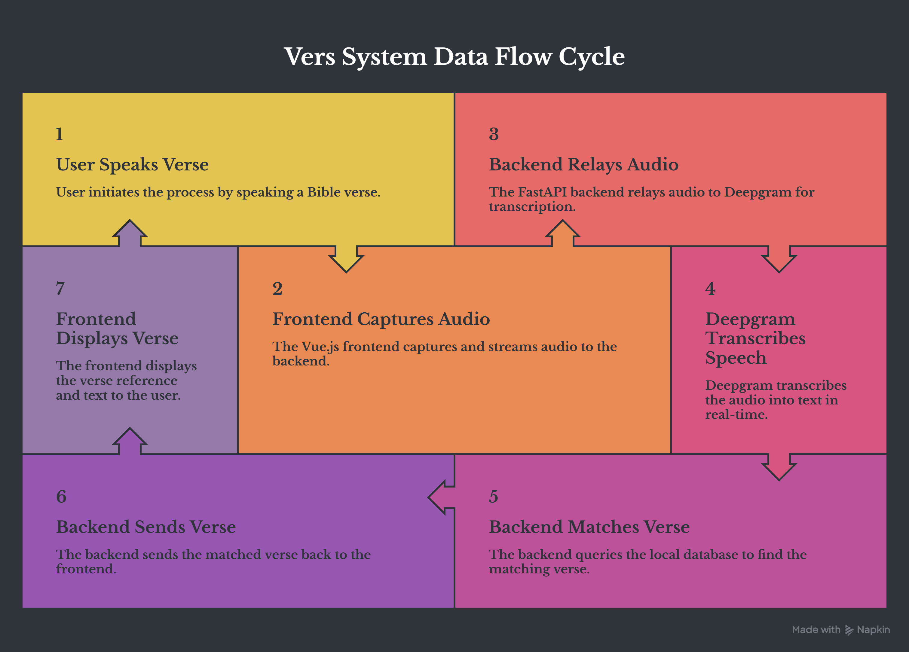

# Vers

**"Shazam for Bible verses."** Speak a verse out loud, and Vers identifies the exact book, chapter, and verse — in real time, with no LLM or embeddings involved in the matching itself.




## Overview

Vers is a voice-driven web app that listens to a spoken Bible verse and returns the matching reference and full text. Speech-to-text is handled by Deepgram; verse identification is handled entirely by classic text search (full-text search + fuzzy string matching) against a locally hosted Bible database — deliberately avoiding AI-based matching to keep the lookup fast, deterministic, and explainable.

## Core Principles

- **No AI in the matching engine.** Verse identification uses full-text search + trigram fuzzy matching, not embeddings or an LLM.
- **Local-first data.** The Bible text lives in your own database (SQLite/Postgres), not behind a third-party API, to eliminate network latency on every lookup.
- **Backend-controlled STT.** Speech-to-text runs server-side (not in the browser) so the Deepgram API key never touches the client, and the transcript can be matched against the verse database without an extra round trip.

## Tech Stack

| Layer | Choice |
|---|---|
| Frontend | Vue.js, Web Audio API / AudioWorklet, WebSocket client |
| Backend | FastAPI (Python, async), Tortoise ORM |
| Database | SQLite (FTS5) for dev, PostgreSQL (full-text search + `pg_trgm`) for production |
| Speech-to-Text | Deepgram (Nova-3, streaming) |
| Matching Engine | Full-text search (candidate shortlist) + trigram fuzzy matching (final ranking) |

## How It Works (High Level)

1. User taps "Listen" in the Vue frontend; microphone audio streams to the FastAPI backend over a WebSocket.
2. The backend forwards that audio, chunk by chunk, to Deepgram's streaming endpoint over its own WebSocket connection.
3. Deepgram returns a finalized transcript once the user stops speaking.
4. The backend runs the transcript against the local Bible database: full-text search narrows the field, trigram fuzzy matching picks the best result.
5. The matched verse (book, chapter, verse, text) is pushed back to the frontend over the original WebSocket and displayed.

See `ARCHITECTURE.md` for the full component-and-data-flow breakdown.

## Project Structure

```
vers/
├── backend/
│   ├── app/
│   │   ├── main.py                # FastAPI app entrypoint
│   │   ├── websocket.py           # /ws/listen handler (frontend <-> backend <-> Deepgram)
│   │   ├── models/
│   │   │   └── verse.py           # Tortoise ORM model for Bible verses
│   │   ├── services/
│   │   │   ├── deepgram_client.py # Manages Deepgram streaming connection
│   │   │   └── verse_matcher.py   # FTS + fuzzy matching logic
│   │   ├── db/
│   │   │   └── init.py            # DB connection + FTS index setup
│   │   └── config.py              # Env var loading
│   ├── data/
│   │   └── bible_verses.sqlite    # Local Bible dataset (or migration scripts for Postgres)
│   └── requirements.txt
├── frontend/
│   ├── src/
│   │   ├── components/
│   │   │   ├── ListenButton.vue
│   │   │   └── VerseResult.vue
│   │   ├── services/
│   │   │   └── websocket.js       # Mic capture + WebSocket streaming to backend
│   │   └── App.vue
│   └── package.json
├── README.md
└── ARCHITECTURE.md
```

## Setup

### Backend

```bash
cd backend
python -m venv venv
source venv/bin/activate
pip install -r requirements.txt
# Load Bible dataset and build FTS index
python -m app.db.init
uvicorn app.main:app --reload
```

### Frontend

```bash
cd frontend
npm install
npm run dev
```

## Environment Variables

| Variable | Description |
|---|---|
| `DEEPGRAM_API_KEY` | Deepgram API key (backend only — never exposed to frontend) |
| `DATABASE_URL` | Connection string for SQLite or PostgreSQL |
| `DEEPGRAM_MODEL` | e.g. `nova-3` |
| `ENDPOINTING_MS` | Silence duration before Deepgram finalizes a transcript (default: 300) |
| `UTTERANCE_END_MS` | Backup silence detector for noisy environments (default: 1000) |

## Database Schema

**`verses` table**

| Column | Type | Notes |
|---|---|---|
| `id` | integer, PK | |
| `book` | text | e.g. "John" |
| `book_order` | integer | for canonical sorting |
| `chapter` | integer | |
| `verse` | integer | |
| `text` | text | full verse text, indexed for FTS + trigram search |
| `version` | text | e.g. "KJV", "NIV" |

## API / WebSocket Reference

- `WS /ws/listen` — accepts streamed audio from the frontend, returns transcript status updates and the final matched verse as JSON
- `GET /api/verse/{book}/{chapter}/{verse}` — direct verse lookup by reference
- `GET /api/search?q=` — text-based fallback search (typed queries, not voice)

